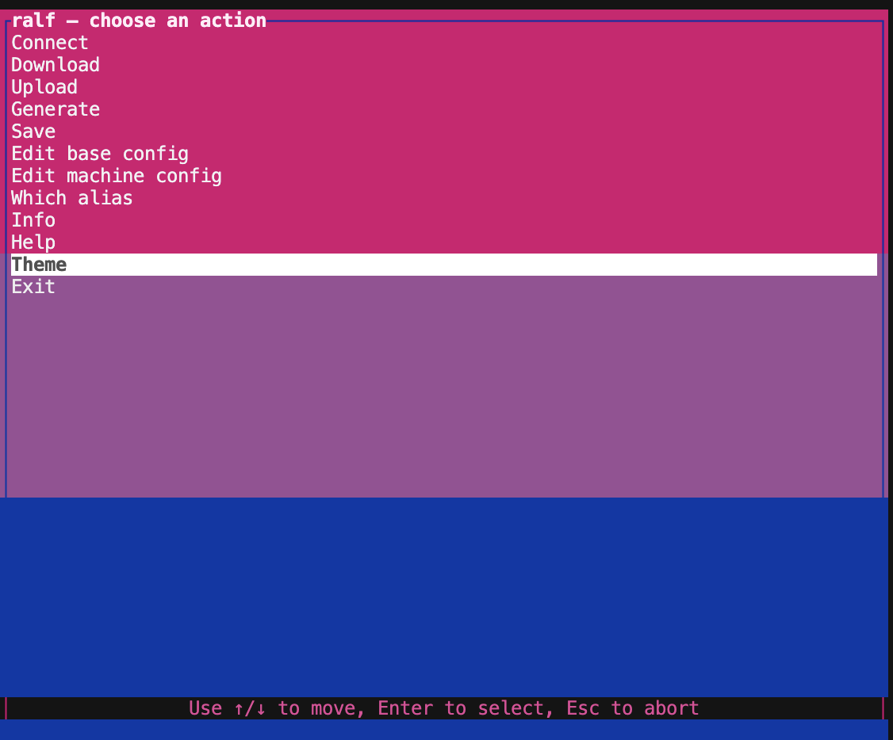
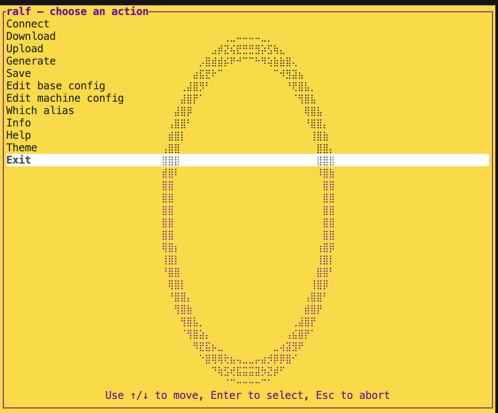
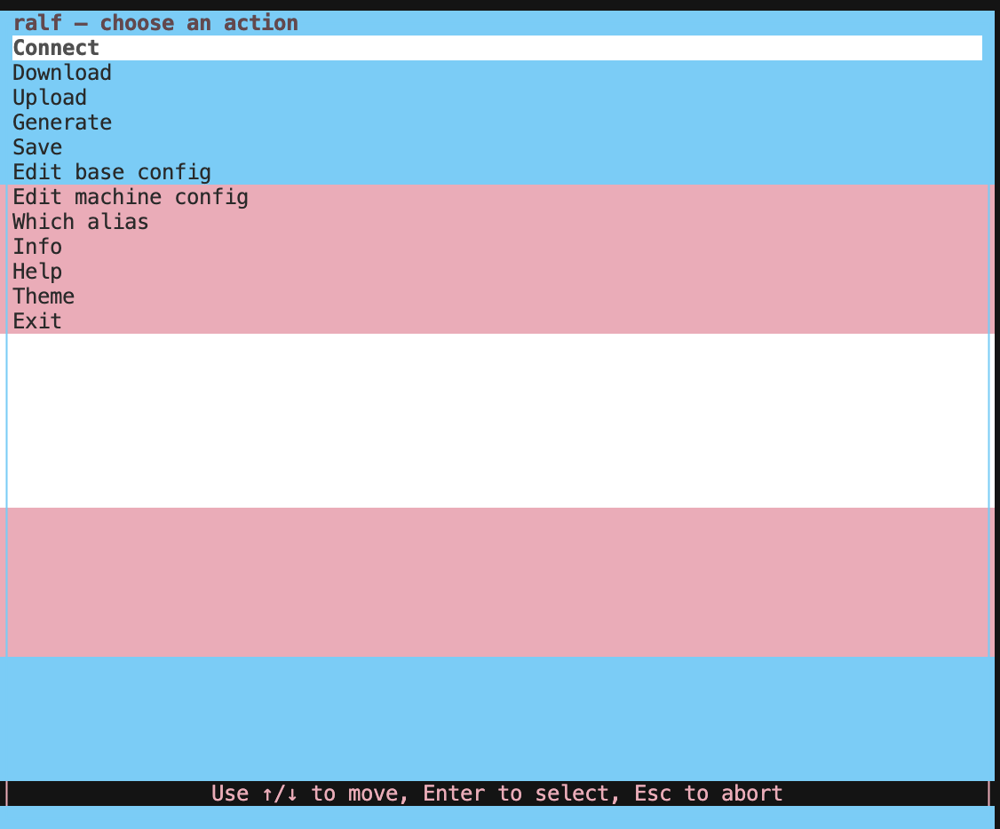
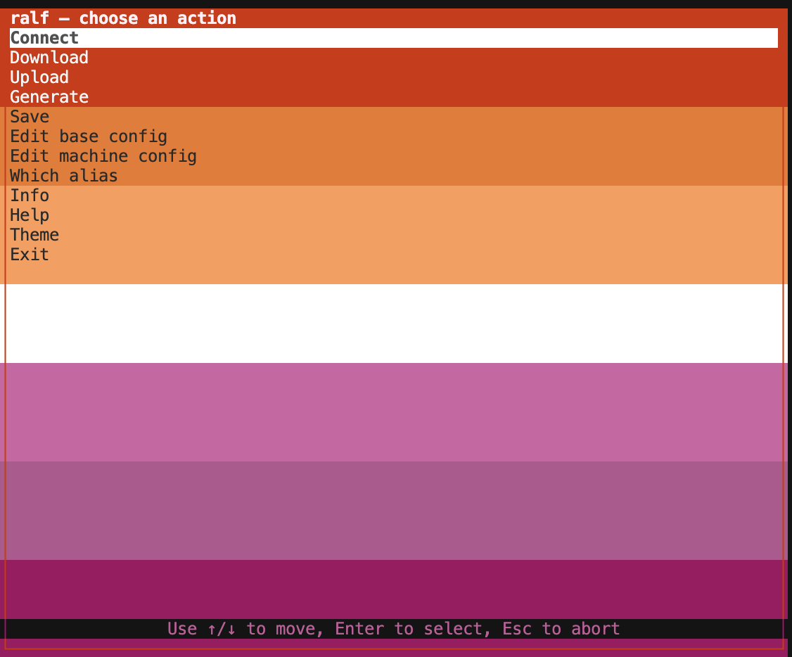
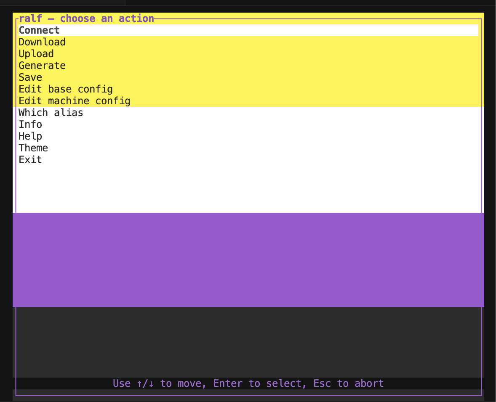
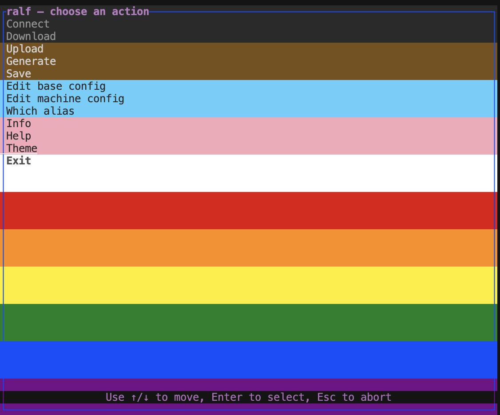

Based on alf by Danny Ben, - https://github.com/DannyBen/alf

ralf 🏳️‍⚧️ is a fully alf compatible pure-rust rewrite that brings along native zsh support combined with muti-machine support via layers using a new `machine` command 

as well as all of the functionality in alf, ralf supports
    
- multi-machine layers, useful where commands might have to run in sudo on some machines but not on others 
    
- Native ZSH support for mac users, no bash install needed,
    
- a terminal user interface for a more intergrated experience, 
    
- Non-Optional Pride Flag Branding

you can also run ralf in classic mode for a more alf like experience using `ralf [COMMAND]`
all new commands support this mode as well. 